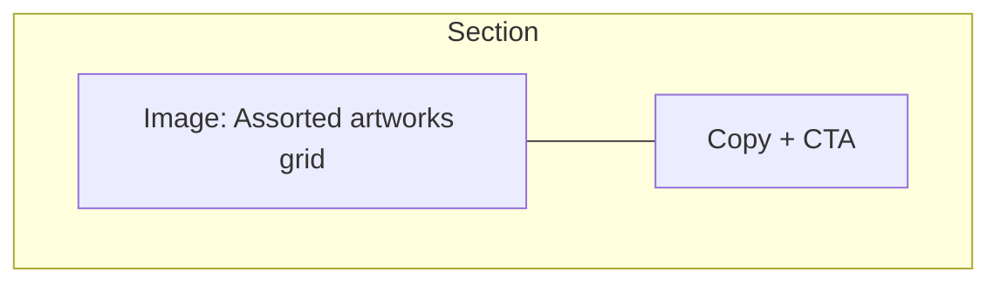

# Bulk Appraisal Landing Page Section — Specification & Requirements

> **Purpose:** Add a dedicated, high-converting section on the main landing page that promotes the "Bulk Appraisal Process" and funnels users directly to `/bulk-appraisal/upload`.

---

## 1. Section Overview

1. **Section ID**: `bulk-appraisal`
2. **Placement on Page**: Directly **after** the existing "Process" section and **before** testimonials.  
   • Rationale: Users who understand the basic process are primed to see the bulk-appraisal upsell before social proof.
3. **Primary Goal**: Convert collectors with multiple items into starting the streamlined bulk-appraisal flow.

---

## 2. Target Audience & Pain Points

| Persona | Pain Point | How the Section Resolves It |
|---------|------------|-----------------------------|
| Estate executors | Need rapid, reliable values for many items | Emphasise "send photos, we do the work" & 24-48 h turnaround |
| Insurance agents | Require documentation for high-volume cover notes | Highlight legally-accepted appraisal PDFs & bulk discount |
| Collectors / resellers | Don't want to research every piece individually | Stress one-click upload & per-item price reduction |

---

## 3. Core Messaging

1. **Headline (H2)**: "Have a Whole Collection? Let Us Appraise Everything—Fast."
2. **Sub-headline (H3 / lead)**: "Upload all your photos once, relax, and receive a comprehensive appraisal report for every piece within 48 hours."
3. **Value Bullets (✓ list)**:
   - Up to **20 % discount** on multi-item appraisals
   - Professional identification & provenance research for each item
   - Insurance-grade PDF & CSV reports ready for download
   - Dedicated support liaison for large collections (>30 items)
4. **Trust Badges**: "USPAP-Compliant", "ISO-Certified Valuers", "Money-Back Guarantee". Re-use existing badge component.
5. **Primary CTA Button**: "Start Bulk Appraisal" → links to `/bulk-appraisal/upload` (open in same tab).  
   • Button variant: **High-Conversion Amber** class set from style guide.
6. **Secondary Link**: "Talk to an expert first" → opens scheduling modal (existing `ContactExpertModal`). Uses **Text Button / Link** style.

---

## 4. Visual & Layout Specifications

### 4.1 Wireframe (conceptual)

| Element | Desktop Layout | Mobile Layout |
|---------|----------------|---------------|
| Illustration | 50 % width left column. Utilise lazy-loaded `ImageKit` responsive image (e.g., `collection-grid.jpg`). | Full-width top, height-auto, followed by copy. |
| Copy & CTA | 50 % right column using flex > `flex-col justify-center gap-6`. | Stacked under image with `mt-8`. |

### 4.2 Tailwind Utility Classes (reuse from style plan)

- **Section Container**: `section id="bulk-appraisal" class="py-24 bg-gray-50"` wrapped in `Container` component (`mx-auto max-w-7xl px-4 sm:px-6 lg:px-8`).
- **Headline**: `text-4xl font-bold text-gray-900 leading-tight` (desktop); `text-3xl` (mobile via `sm:text-4xl`).
- **Sub-headline**: `mt-4 text-lg text-gray-700 max-w-xl`.
- **Bullet List**: `mt-6 space-y-3 text-base text-gray-700` with ✅ icon prefix (use `LucideCheck` 20×20, `text-blue-600`).
- **Primary CTA** (High-Conversion): `bg-gradient-to-r from-amber-500 to-amber-600 text-white font-semibold rounded-lg px-6 py-3 shadow-lg hover:from-amber-600 hover:to-amber-700 transition-all duration-200`.  
  Include right-aligned chevron icon (`LucideArrowRight`) sized 18.
- **Secondary Link**: `mt-4 text-blue-600 hover:text-blue-800 inline-flex items-center gap-2 font-medium`.

---

## 5. Copywriting Details (ready-to-use)

> **Headline**  
> *Have a Whole Collection? Let Us Appraise Everything—Fast.*

> **Sub-headline**  
> Upload all your images once, relax, and get a complete, expert-signed appraisal report for every artwork or antique within 48 hours.

> **Bullet Points**
> 1. Save up to **20 %** on multi-item appraisals  
> 2. Individual descriptions, condition notes, and valuations  
> 3. Insurance-ready PDF & CSV report delivered via email  
> 4. Dedicated support liaison for collections over 30 items  
> 5. 100 % money-back accuracy guarantee

> **Primary CTA Label**: *Start Bulk Appraisal*  
> **Secondary CTA Label**: *Talk to an expert first*

---

## 6. Accessibility & SEO

1. `aria-labelledby="bulk-appraisal-heading"` on container.
2. Image: `alt="Assorted fine art and antique pieces laid out for appraisal"`.
3. Structured data: Extend existing `Service` JSON-LD with `isSimilarTo` referencing bulk appraisal.
4. Ensure buttons have `role="button"`, focus ring (`focus:outline-none focus:ring-4 focus:ring-blue-100`).

---

## 7. Analytics & Tracking

- Fire existing `gtag('event', 'bulk_appraisal_click')` on primary CTA.
- Data-layer push: `{ event: 'cta_click', cta_type: 'bulk_appraisal' }`.

---

## 8. Reusable Components Reference

| Component | File | Variant / Props to Use |
|-----------|------|------------------------|
| `Container` | `src/components/core/Container.tsx` | default |
| `Button` | `src/components/core/Button.tsx` | `variant="amber" size="lg"` (new prop if missing) |
| `Badge` | `src/components/core/Badge.tsx` | pre-existing badge data |
| `LazyImage` | `src/components/utility/LazyImage.tsx` | `src`, `alt`, `aspectRatio="16/9"` |

Ensure **no duplicate styles**: all colour, spacing & typography tokens must come from `style-standardization-plan.md`.

---

## 9. Implementation Checklist (for dev team)

- [ ] Add images to `src/images/collections/collection-grid.jpg` & resize variants via ImageKit.
- [ ] Implement React component `BulkAppraisalSection.tsx` inside `src/components/sections/`.
- [ ] Add anchor `<Link to="#bulk-appraisal" />` from global nav "Services".
- [ ] Insert section into `ArtAppraiser.tsx` storyline between `Process` and `SuccessStories`.
- [ ] Verify responsive snapshots (375px, 768px, 1280px) with Percy.
- [ ] Run `npm run lint` & `npm run preview`.

---

## 10. Review Notes

• This spec **only** describes the new marketing section; no other features should be altered.  
• Maintain single-source-of-truth styling by importing shared tokens.  
• Avoid inline scripts; reuse existing analytics helpers.  
• Consult `style-standardization-plan.md` for any new colour or spacing decisions before adding extra utilities. 